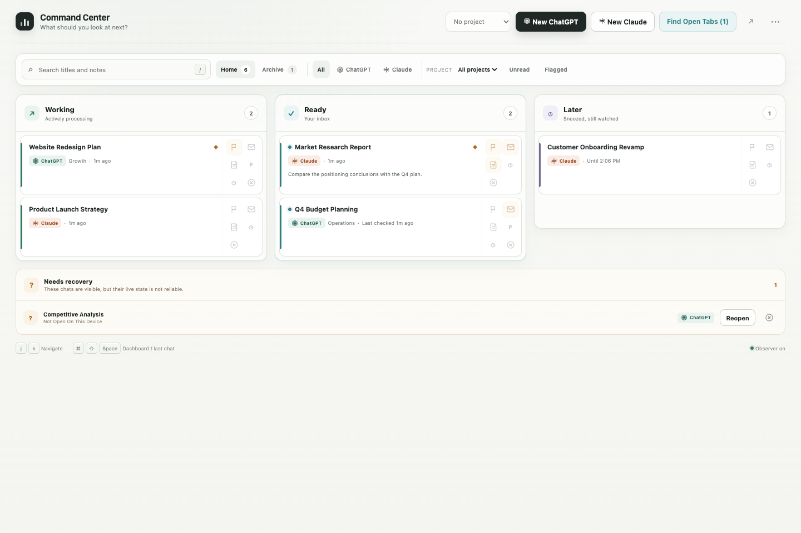
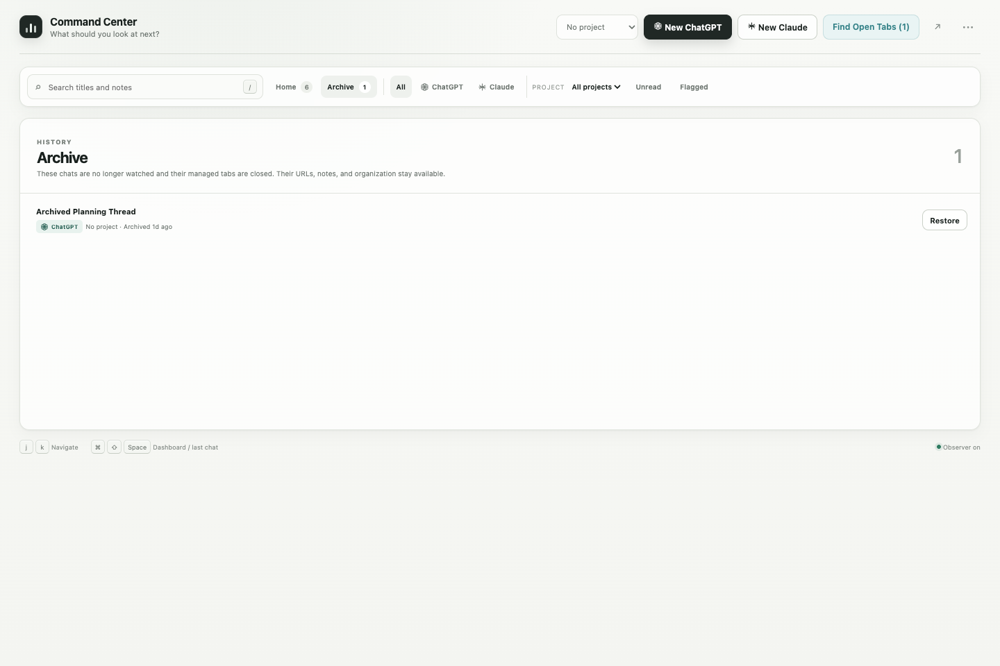

# AI Chat Command Center

A local-first Manifest V3 Chrome extension for the ChatGPT and Claude conversations you intentionally track. It gives those real provider tabs one focused home screen without replacing either platform, automating it, or collecting conversation content.

[](https://github.com/magruder-tools/ai-chat-command-center/actions/workflows/ci.yml)



> The screenshots use synthetic local data. No real ChatGPT or Claude account or conversation was used to create them.

## What the MVP does

- Opens a dedicated, maximized Chrome workspace window from the extension toolbar.
- Keeps its dashboard first and all tracked ChatGPT and Claude tabs in a collapsed group named **Command Center Chats**.
- Starts a real ChatGPT or Claude tab from a clearly labeled platform button. You still select modes, type, and submit manually on the original site.
- Automatically discovers open, untracked ChatGPT and Claude tabs for individual review and registration.
- Automatically registers chats launched from the dashboard and repairs the observer in already-open pages without reloading them.
- Shows **Working**, **Ready**, and **Later** as the primary workflow. Unknown state stays visible in a secondary recovery area.
- Mirrors the exact current Chrome tab title on every title change. There is no separate rename system.
- Passively observes a small set of visible running/composer landmarks. It never clicks, types, submits, approves, reloads, or calls private APIs.
- Filters by ChatGPT or Claude using recognizable platform marks, and by known native ChatGPT Projects using stable URL information when available.
- Preserves an intended conversation URL and offers one-click recovery if a tracked tab navigates to a different conversation or platform.
- Supports searchable notes, platform filters, unread, flag, snooze, archive, undo, restore, and keyboard navigation.
- Syncs durable metadata through Chrome Sync while keeping tab IDs and live observer status device-local.
- Exports metadata as JSON, CSV, or a plain-text URL list and includes a global observer kill switch.

## Install a release

Download the latest ZIP from [GitHub Releases](https://github.com/magruder-tools/ai-chat-command-center/releases/latest), extract it to a permanent folder, and keep that folder in place while the extension is installed.

1. Open `chrome://extensions`.
2. Turn on **Developer mode**.
3. Click **Load unpacked**.
4. Select the extracted folder containing `manifest.json`.
5. Pin **AI Chat Command Center** to the toolbar.
6. Click its toolbar icon. Chrome opens or focuses the dedicated workspace window.
7. Leave the experimental observer off until you complete [the manual safety checklist](docs/manual-test-checklist.md).

Do not select the ZIP itself. Chrome requires the extracted directory, and deleting or moving that directory will break the unpacked installation.

The extension does not handle sign-in. Sign in normally on the real `chatgpt.com` and `claude.ai` pages.

### Install with an AI computer assistant

Attach the downloaded release ZIP to Codex or another computer-use assistant and send this prompt:

> Install the attached AI Chat Command Center Chrome extension for me. First inspect the ZIP and verify that it contains a valid Manifest V3 extension named AI Chat Command Center. Extract it to a permanent folder in my Documents directory, not a temporary folder, and do not modify its files.
>
> Then open `chrome://extensions`, enable Developer mode, choose **Load unpacked**, and select the extracted folder containing `manifest.json`. I authorize installing this attached extension and approving its stated access to `chatgpt.com` and `claude.ai`.
>
> Do not remove, disable, reload, or change any other extensions. If Chrome requests broader permissions than those two websites plus extension storage and tab management, stop and explain them to me.
>
> After installation, verify that **AI Chat Command Center** appears as version **0.3.1**, opens successfully, and shows its dashboard. Tell me where the permanent extracted folder is located and how to open the Command Center.

Chrome or the assistant may still request a final confirmation immediately before installing the unpacked extension or approving site access.

## Build from source

Requirements: Node.js 22 or newer and pnpm 11.

```bash
git clone https://github.com/magruder-tools/ai-chat-command-center.git
cd ai-chat-command-center
pnpm install --frozen-lockfile
pnpm release
```

Then load `release/unpacked/` from `chrome://extensions`.

## Daily use

### Start a chat

Click **New ChatGPT** or **New Claude**. The new tab is registered and watched automatically. For ChatGPT, you can first register and select a native Project using its `g-p-*` Project URL. Claude Project organization is not inferred in this MVP.

### Track an existing tab

Open an existing `https://chatgpt.com/*` or `https://claude.ai/*` tab in any ordinary Chrome window and click the extension toolbar icon. The dashboard opens with a registration dialog, displays the detected platform, and offers native Project assignment only for ChatGPT. The tab then moves into the managed workspace.

Alternatively, use **Find Open Tabs** in the dashboard. Command Center detects every open untracked ChatGPT and Claude tab but never watches one until you confirm it.

### Navigate

- Click a row to open its real ChatGPT or Claude tab.
- Use `j` / `k` or the arrow keys to move through visible rows.
- Press `/` to focus title search.
- Press `Command+Shift+Space` on macOS (`Ctrl+Shift+Space` elsewhere) to toggle between the dashboard and the most recently viewed tracked chat.
- Returning to the dashboard collapses the managed chat tab group.

### Status and lifecycle

- **Working:** a supported visible running/stop control is present.
- **Ready:** the platform's composer is available and the page is not Working. Finished answers, questions, approvals, confirmations, and forms all remain Ready.
- **Later:** the record is snoozed, while its underlying tab continues to be watched.
- **Unknown:** the observer is starting, stale, disconnected, missing expected landmarks, or the tab is closed, discarded, frozen, or viewing a different conversation.
- **Stop watching & close:** closes the managed tab and keeps its URL, note, platform, and organization in Archive. Restore reopens the intended provider URL.

## Develop and verify

```bash
pnpm install --frozen-lockfile
pnpm lint
pnpm typecheck
pnpm test
pnpm build
pnpm e2e
pnpm release
```

Unit tests use synthetic DOM fixtures. Playwright opens only the local demo route and does not access or sign into ChatGPT or Claude.

## Permissions

| Permission | Why it is needed |
| --- | --- |
| `storage` | Chrome Sync metadata and device-local runtime state |
| `tabs` | Exact tab titles, lifecycle, focus, movement, and recovery |
| `tabGroups` | The collapsed **Command Center Chats** group |
| `scripting` | Idempotently repair the passive observer in an already-open supported chat tab without reloading it |
| `https://chatgpt.com/*` | The passive, read-only content observer on real ChatGPT pages |
| `https://claude.ai/*` | The passive, read-only content observer on real Claude pages |

The manifest does **not** request notifications, cookies, `webRequest`, debugger access, all-sites access, or any permission to read browser history.

## Current limitations

- The passive observer is **Experimental / Unofficial** and intentionally conservative. ChatGPT or Claude can change visible landmarks without notice; the extension then reports Unknown instead of guessing.
- DOM changes still update status immediately. A 30-second heartbeat with a 90-second grace period tolerates Chrome's background timer throttling; last-observed Ready stays in Ready while disconnected or paused, and stale Working moves to recovery.
- Activating a watched chat forces an observer reinjection/rescan. Opening the dashboard repairs missing or stale observer connections without periodically reloading provider pages.
- Native ChatGPT Project detection only recognizes an explicit `g-p-*` URL segment. Project names come from a manual registration or previously encountered Project record. It does not crawl either platform's sidebar or account, and Claude Project organization is not tracked yet.
- Chrome can still discard or freeze tabs under memory pressure despite `autoDiscardable: false`; the dashboard surfaces that as Unknown with a Reopen action.
- Chrome does not provide a true shared-element animation across separate browser tabs. The dashboard uses a short open/return approximation.
- Synced chats from another computer appear not open on this device until reopened here. Live status never pretends to sync across devices.
- Full-screen mode is entered only from the dashboard control. Exiting returns the workspace to maximized mode.

## Privacy and security

See [PRIVACY.md](PRIVACY.md) and [SECURITY.md](SECURITY.md). In short: there is no backend, telemetry, analytics, advertising, message storage, credentials, cookies, session-token access, remote code, or provider network interception.

This is an independent, unofficial project and is not affiliated with or endorsed by OpenAI or Anthropic.

## Contributing

Bug reports and pull requests are welcome. Observer reports must use synthetic descriptions and must never include real conversation content, credentials, cookies, tokens, or account data. See [CONTRIBUTING.md](CONTRIBUTING.md).

## License

MIT — see [LICENSE](LICENSE).

### Archive view


